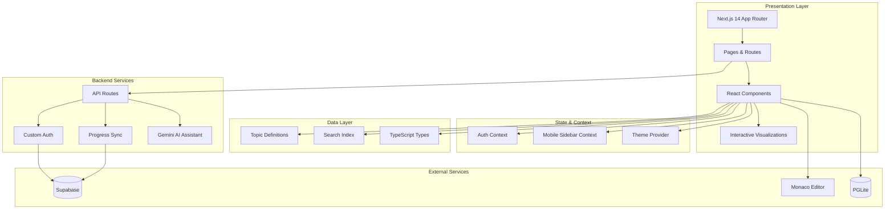
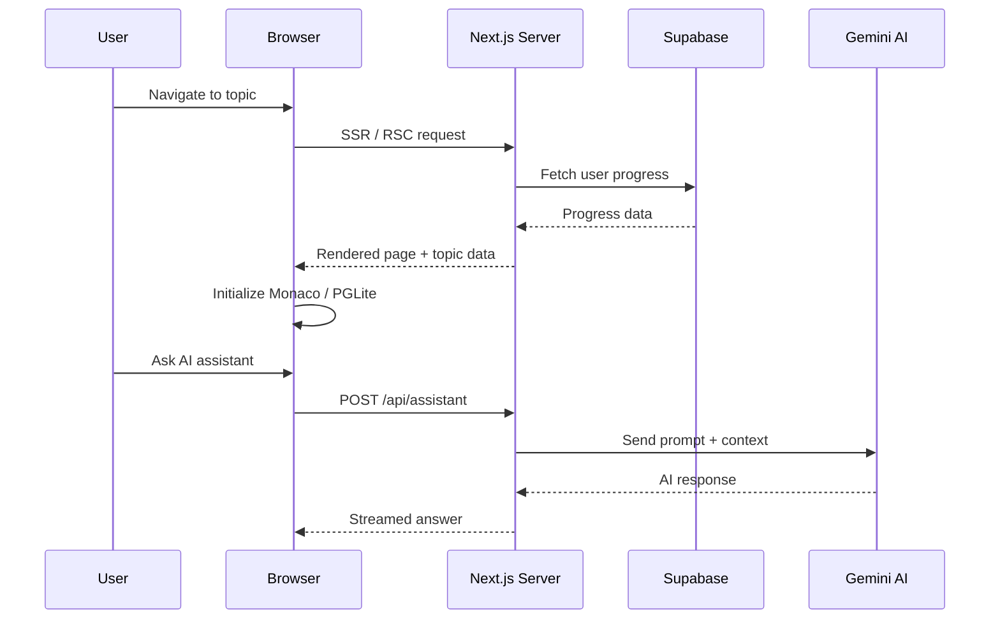
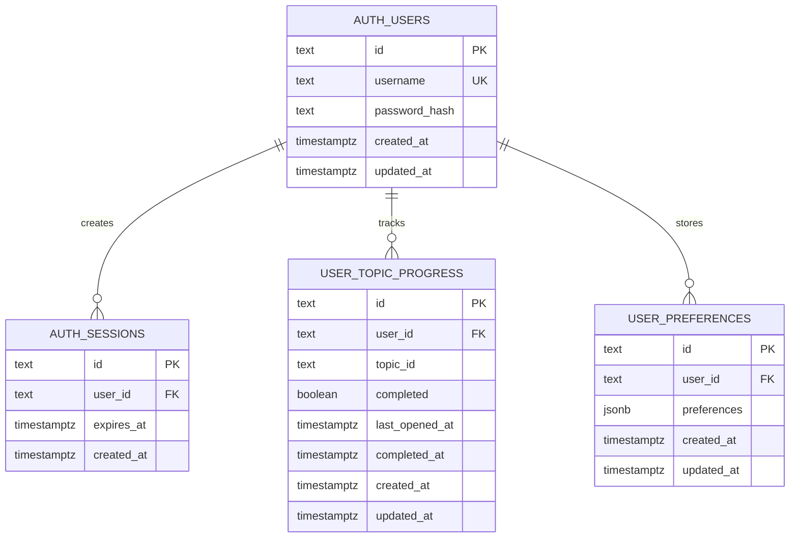

<div align="center">


# Interview Handbook

### The definitive platform for mastering technical interviews

[](./LICENSE)
[](https://nextjs.org/)
[](https://www.typescriptlang.org/)
[](https://github.com/sangisapusaiteja/InterviewHandbook/actions)

[Features](#features) · [Architecture](#architecture) · [Topics](#topics-covered) · [Quick Start](#quick-start) · [Tech Stack](#tech-stack) · [Contributing](#contributing)

</div>

---

## Features

| Feature | Description |
|---------|-------------|
| **500+ Topics** | 9 categories — HTML, CSS, JavaScript, DSA, Python, PostgreSQL, React, System Design, Technical Q&A |
| **Algorithm Visualizations** | 60+ animated walkthroughs — Two Sum, Dijkstra, Flood Fill, Merge Sort, and more |
| **Live Code Editor** | Monaco-powered editor with syntax highlighting and execution |
| **PostgreSQL Sandbox** | Run SQL queries directly in your browser via PGLite |
| **Progress Analytics** | Streaks, activity heatmap, and badges on your personal dashboard |
| **AI Assistant (AJet)** | Ask questions and get instant explanations for any topic |
| **Dark / Light Mode** | Seamless theme switching powered by next-themes |
| **Custom Auth** | Username + password accounts backed by Supabase |
| **LeetCode Links** | Direct links to practice problems for each DSA topic |

---

## Architecture



### Request Flow



### Database Schema



---

## Topics Covered

| Category | Topics | What You'll Learn |
|----------|--------|-------------------|
| **HTML** | 49 | Semantic elements, ARIA, forms, HTML5 APIs, SEO |
| **CSS** | 52 | Flexbox, Grid, animations, responsive design, specificity |
| **JavaScript** | 80 | Closures, prototypes, event loop, async/await, ES6+, DOM |
| **DSA** | 64 | Arrays, linked lists, trees, graphs, sorting, DP, searching |
| **Python** | 98 | Data structures, OOP, decorators, generators, stdlib |
| **PostgreSQL** | 76 | Queries, joins, indexes, transactions, window functions, CTEs |
| **React** | 18 | Components, hooks, context, performance, advanced patterns |
| **System Design** | 52 | Scalability, databases, caching, load balancing, case studies |
| **Technical Q&A** | 12 | Framework-specific interview questions |

Every topic includes concept explanations, interactive visualizations, code examples with live editor, and interview questions with hints.

---

## Quick Start

### Prerequisites

- **Node.js** 18+
- **Supabase** project ([create one](https://supabase.com))

### Install

```bash
git clone https://github.com/sangisapusaiteja/InterviewHandbook.git
cd InterviewHandbook
npm install
```

### Configure

```bash
cp .env.example .env.local
```

| Variable | Description |
|----------|-------------|
| `NEXT_PUBLIC_SUPABASE_URL` | Supabase project URL |
| `SUPABASE_SERVICE_ROLE_KEY` | Service role key (server-side only) |
| `GEMINI_API_KEY` | Google AI Studio key for AJet |
| `GEMINI_MODEL` | Optional — defaults to `gemini-2.5-flash-lite` |

### Initialize Database

Run the contents of [`supabase/schema.sql`](./supabase/schema.sql) in the Supabase SQL Editor.

### Run

```bash
npm run dev
```

Open [http://localhost:3000](http://localhost:3000).

---

## Tech Stack

| Layer | Technology |
|-------|------------|
| **Framework** | [Next.js 14](https://nextjs.org/) (App Router) |
| **Language** | [TypeScript 5](https://www.typescriptlang.org/) |
| **Styling** | [Tailwind CSS 3](https://tailwindcss.com/) |
| **Components** | [shadcn/ui](https://ui.shadcn.com/) + [Radix UI](https://www.radix-ui.com/) |
| **Animations** | [Framer Motion](https://www.framer.com/motion/) |
| **Code Editor** | [Monaco Editor](https://microsoft.github.io/monaco-editor/) |
| **SQL Sandbox** | [PGLite](https://pglite.dev/) |
| **Backend** | [Supabase](https://supabase.com/) (Auth + Database) |
| **AI** | [Google Gemini](https://ai.google.dev/) |
| **Testing** | [Vitest](https://vitest.dev/) |
| **CI** | [GitHub Actions](https://github.com/features/actions) |

---

## Project Structure

```
src/
├── app/
│   ├── (auth)/                  # Sign-in / Sign-up pages
│   ├── (main)/                  # Dashboard & all category pages
│   └── api/                     # API routes (auth, progress, assistant)
├── components/
│   ├── css/visualizations/      # CSS interactive demos
│   ├── dsa/visualizations/      # Algorithm visualizations
│   ├── dsa/stepcharts/          # Step-by-step execution charts
│   ├── html/visualizations/     # HTML demos
│   ├── javascript/visualizations/
│   ├── python/visualizations/
│   ├── postgresql/visualizations/
│   ├── react/visualizations/
│   ├── layout/                  # Navbar, sidebar, search, user menu
│   └── ui/                      # shadcn/ui primitives
├── data/                        # Topic content definitions
├── types/                       # TypeScript type definitions
├── hooks/                       # Custom React hooks
├── contexts/                    # React context providers
├── lib/                         # Utilities (auth, Supabase, progress)
├── providers/                   # Theme provider
└── test/                        # Test setup and tests
```

---

## Roadmap

- [x] 500+ topics across 9 categories
- [x] Interactive algorithm visualizations
- [x] Code editor with live execution
- [x] PostgreSQL in-browser sandbox
- [x] Progress tracking & analytics
- [x] Custom username + password accounts
- [ ] Spaced repetition review mode
- [ ] Daily interview questions
- [ ] Flashcards for quick review
- [ ] Offline mode (PWA)
- [ ] Community discussion per topic

---

## Contributing

Contributions are welcome. Open an issue or submit a pull request.

## License

[MIT](./LICENSE) — built for educational purposes.
