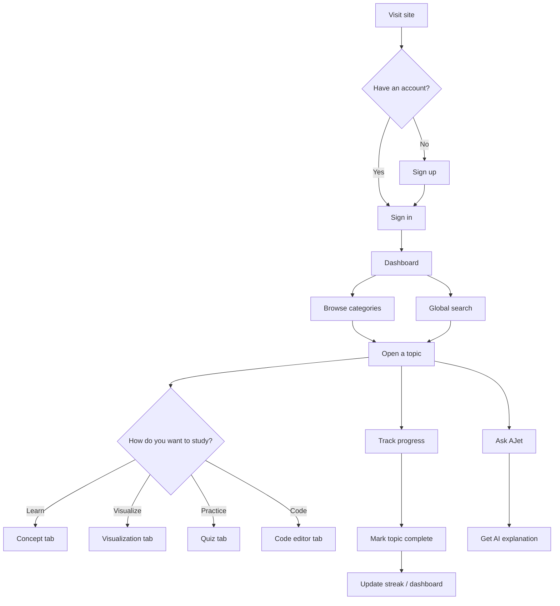
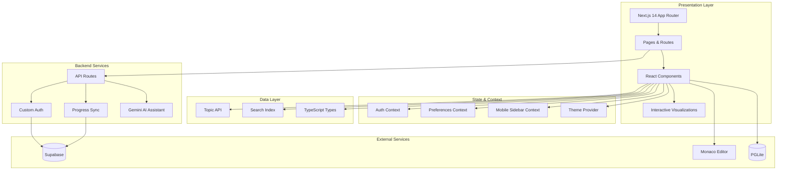
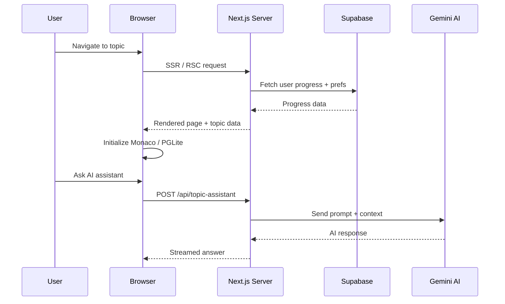
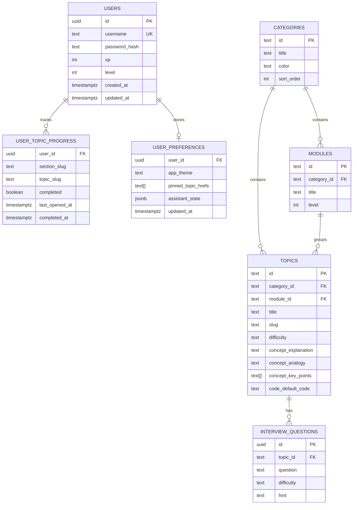

<div align="center">


# Interview Handbook

### The definitive platform for mastering technical interviews

[](./LICENSE)
[](https://nextjs.org/)
[](https://www.typescriptlang.org/)
[](https://supabase.com/)

**A comprehensive, beginner-friendly interview preparation platform — 500+ topics, interactive visualizations, a live code editor, and an AI assistant.**

[Features](#features) · [User Flow](#user-flow) · [Architecture](#architecture) · [Database Schema](#database-schema) · [Topics Covered](#topics-covered) · [Quick Start](#quick-start) · [Tech Stack](#tech-stack) · [Contributing](#contributing)

</div>

---

## Features

| Feature | Description |
|---------|-------------|
| **500+ Topics** | 9 categories — HTML, CSS, JavaScript, DSA, Python, PostgreSQL, React, System Design, Technical Q&A |
| **Algorithm Visualizations** | 60+ animated walkthroughs — Two Sum, Dijkstra, Flood Fill, Merge Sort, and more |
| **Live Code Editor** | Monaco-powered editor with syntax highlighting and execution |
| **PostgreSQL Sandbox** | Run SQL queries directly in your browser via PGLite |
| **Progress Analytics** | Streaks, activity heatmap, and badges on your personal dashboard |
| **AI Assistant (AJet)** | Ask questions and get instant explanations for any topic |
| **Dark / Light Mode** | Seamless theme switching powered by next-themes |
| **Custom Auth** | Username + password accounts backed by Supabase |
| **Global Search** | Instant natural-language search across all topics and modules |

---

## User Flow



1. **Authenticate** — sign up with a username + password, then sign in.
2. **Dashboard** — resume where you left off, view progress, and browse all 9 categories.
3. **Study a topic** — open any topic and switch between the **Concept**, **Visualization**, **Quiz**, and **Code Editor** tabs.
4. **Track progress** — mark topics complete; your streak, activity heatmap, and completion counts update in real time.
5. **Get help** — use the **AJet** assistant for guided explanations on any topic.
6. **Jump anywhere** — use **global search** (`/` or `Alt+K`) to instantly find any topic.

---

## Architecture



### Request Flow



---

## Database Schema

The app runs on a shared Supabase PostgreSQL database (the `users` table is shared with **Code Battle**). Row Level Security is enabled on every table.



### Table Reference

| Table | Purpose |
|-------|---------|
| `users` | Shared identity table (username + bcrypt password hash, XP/level). |
| `user_topic_progress` | Per-user topic completion and last-opened tracking. |
| `user_preferences` | Theme, pinned topics, recent queries, AI assistant state. |
| `categories` | Top-level sections (HTML, CSS, JavaScript, …). |
| `modules` | Learning-path groupings within a category. |
| `topics` | Core content — explanation, analogy, key points, starter code. |
| `interview_questions` | Practice questions + hints per topic. |

The schema lives in [`supabase/schema.sql`](./supabase/schema.sql) and content in [`supabase/seed.sql`](./supabase/seed.sql).

---

## Topics Covered

| Category | Topics | What You'll Learn |
|----------|--------|-------------------|
| **HTML** | 49 | Semantic elements, ARIA, forms, HTML5 APIs, SEO |
| **CSS** | 68 | Flexbox, Grid, animations, responsive design, specificity |
| **JavaScript** | 80 | Closures, prototypes, event loop, async/await, ES6+, DOM |
| **DSA** | 64 | Arrays, linked lists, trees, graphs, sorting, DP, searching |
| **Python** | 98 | Data structures, OOP, decorators, generators, stdlib |
| **PostgreSQL** | 76 | Queries, joins, indexes, transactions, window functions, CTEs |
| **React** | 18 | Components, hooks, context, performance, advanced patterns |
| **System Design** | 52 | Scalability, databases, caching, load balancing, case studies |
| **Technical Q&A** | 12 | Framework-specific interview questions |

Every topic includes concept explanations, interactive visualizations, code examples with a live editor, and interview questions with hints.

---

## Quick Start

### Prerequisites

- **Node.js** 18+
- **Supabase** project ([create one](https://supabase.com))

### Install

```bash
git clone https://github.com/sangisapusaiteja/InterviewHandbook.git
cd InterviewHandbook
npm install
```

### Configure

```bash
cp .env.example .env.local
```

| Variable | Description |
|----------|-------------|
| `NEXT_PUBLIC_SUPABASE_URL` | Supabase project URL |
| `SUPABASE_SERVICE_ROLE_KEY` | Service role key (server-side only) |
| `SESSION_SECRET` | JWT signing secret (must match Code Battle) |
| `GEMINI_API_KEY` | Google AI Studio key for AJet |
| `GEMINI_MODEL` | Optional — defaults to `gemini-2.5-flash-lite` |

### Initialize Database

Run the following in the Supabase SQL Editor, in order:

1. `supabase/schema.sql` — tables, RLS, triggers
2. `supabase/seed.sql` — categories, modules, topics, interview questions

### Run

```bash
npm run dev
```

Open [http://localhost:3000](http://localhost:3000).

---

## Tech Stack

| Layer | Technology |
|-------|------------|
| **Framework** | [Next.js 14](https://nextjs.org/) (App Router) |
| **Language** | [TypeScript 5](https://www.typescriptlang.org/) |
| **Styling** | [Tailwind CSS 3](https://tailwindcss.com/) |
| **Components** | [shadcn/ui](https://ui.shadcn.com/) + [Radix UI](https://www.radix-ui.com/) |
| **Animations** | [Framer Motion](https://www.framer.com/motion/) |
| **Code Editor** | [Monaco Editor](https://microsoft.github.io/monaco-editor/) |
| **SQL Sandbox** | [PGLite](https://pglite.dev/) |
| **Backend** | [Supabase](https://supabase.com/) (Auth + Database + RLS) |
| **AI** | [Google Gemini](https://ai.google.dev/) |
| **Testing** | [Vitest](https://vitest.dev/) |

---

## Project Structure

```
src/
├── app/
│   ├── (auth)/                  # Sign-in / Sign-up pages
│   ├── (main)/                  # Dashboard & all category pages
│   └── api/                     # API routes (auth, progress, assistant, search)
├── components/
│   ├── css|dsa|html|javascript|python|postgresql|react/
│   │   └── visualizations/      # Interactive topic demos
│   ├── layout/                  # Navbar, sidebar, search, user menu
│   ├── assistant/               # AJet AI assistant
│   └── ui/                      # shadcn/ui primitives
├── contexts/                    # Auth, preferences, sidebar providers
├── hooks/                       # Custom React hooks
├── lib/                         # Utilities (auth, Supabase, topic API)
├── providers/                   # Theme provider
├── types/                       # TypeScript type definitions
└── test/                        # Test setup and tests

supabase/
├── schema.sql                   # Tables, RLS, triggers
└── seed.sql                     # Categories, modules, topics, questions
```

---

## Roadmap

- [x] 500+ topics across 9 categories
- [x] Interactive algorithm visualizations
- [x] Code editor with live execution
- [x] PostgreSQL in-browser sandbox
- [x] Progress tracking & analytics
- [x] Custom username + password accounts
- [x] Shared preferences (theme, pinned topics, assistant state)
- [ ] Spaced repetition review mode
- [ ] Daily interview questions
- [ ] Flashcards for quick review
- [ ] Offline mode (PWA)
- [ ] Community discussion per topic

---

## Contributing

Contributions are welcome. Open an issue or submit a pull request.

## License

[MIT](./LICENSE) — built for educational purposes.
